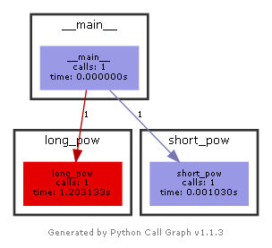

# Interactive Python Cheatsheet in Jupiter notebook format

## Data structures

### List


```python
import bisect

a = []  # Empty list

a: list[int] = [10, 20]
b: list[int] = [30, 40]
a.append(50)  # Add item
b.insert(2, 60)  # Inserts item at index
print(a, b)

a += b
print(f"Add: {a}")

a.reverse()
print(f"Reverse: {a}")

b = sorted(a)  # Returns a new sorted list
a.sort()  # Modifies the list in-place and has no return value
print(f"Sort: {a}, {b}")

print(bisect.bisect(a, 20))  # Locate the insertion point for value in a list to maintain sorted order

bisect.insort(a, 12)  # Insert value in a list in sorted order
print(a)

s: str = "A whole string"
list_of_chars: list = list(s)
print(list_of_chars)
list_of_words: list = s.split()
print(list_of_words)

i: int = list_of_chars.index("w")  # Returns index of the first occurrence or raises ValueError
print(i)
list_of_chars.remove("w")  # Removes first occurrence of the item or raises ValueError
e = list_of_chars.pop(9)  # Removes and returns item at index or from the end.
print(list_of_chars, e)
a.clear()  # Removes all items
```

    [10, 20, 50] [30, 40, 60]
    Add: [10, 20, 50, 30, 40, 60]
    Reverse: [60, 40, 30, 50, 20, 10]
    Sort: [10, 20, 30, 40, 50, 60], [10, 20, 30, 40, 50, 60]
    2
    [10, 12, 20, 30, 40, 50, 60]
    ['A', ' ', 'w', 'h', 'o', 'l', 'e', ' ', 's', 't', 'r', 'i', 'n', 'g']
    ['A', 'whole', 'string']
    2
    ['A', ' ', 'h', 'o', 'l', 'e', ' ', 's', 't', 'i', 'n', 'g'] r
    

### Dictionary


```python
d = {}  # Empty dictionary

d: dict[str, str] = {"Italy": "Pizza", "US": "Hot-Dog", "China": "Dim Sum"}  # Creates a dictionary

k = ["Italy", "US", "China"]  # Creates a dictionary from two collections
v = ["Pizza", "Hot-Dog", "Dim Sum"]
d = dict(zip(k, v))

k = d.keys()  # Collection of keys that reflects changes
v = d.values()  # Collection of values that reflects changes
k_v = d.items()  # Collection of key-value tuples that reflects changes

print(d)
print(k)
print(v)
print(k_v)

print(f"Mapping: {k.mapping['Italy']}")

d.update({"China": "Dumplings"})  # Adds item or replace one with matching keys
print(f"Replace item: {d}")

c = d["China"]  # Read value
print(f"Read item: {c}")

try:
    v = d.pop("Spain")  # Removes item or raises KeyError
except KeyError:
    print("Dictionary key doesn't exist")

b = {k: v for k, v in d.items() if "a" in k}  # Returns a dictionary, filtered by keys
print(b)
c = {k: v for k, v in d.items() if len(v) >= 7}  # Returns a dictionary, filtered by values
print(c)

d.clear() # Removes all items
```

    {'Italy': 'Pizza', 'US': 'Hot-Dog', 'China': 'Dim Sum'}
    dict_keys(['Italy', 'US', 'China'])
    dict_values(['Pizza', 'Hot-Dog', 'Dim Sum'])
    dict_items([('Italy', 'Pizza'), ('US', 'Hot-Dog'), ('China', 'Dim Sum')])
    Mapping: Pizza
    Replace item: {'Italy': 'Pizza', 'US': 'Hot-Dog', 'China': 'Dumplings'}
    Read item: Dumplings
    Dictionary key doesn't exist
    {'Italy': 'Pizza', 'China': 'Dumplings'}
    {'US': 'Hot-Dog', 'China': 'Dumplings'}
    

### defaultdict

The *defaultdict* will create any items that you try to access (provided of course they do not exist yet) without throws a KeyError.


```python
from collections import defaultdict

dd = defaultdict(int)  # defaultdict
print(dd[10])  # print int(), thus 0

dd = {}  # "Regular" dictionary
# print(dd[10])  # throws KeyError
```

    0
    

### Counter

A Counter is a dict subclass for counting hashable objects, it is a collection where elements are stored as dictionary keys and their counts are stored as dictionary values.


```python
from collections import Counter

shirts_colors = ["red", "white", "blue", "white", "white", "black", "black"]
c = Counter(shirts_colors)
print(c)

c["blue"] += 1
print(f"After shopping: {c}")
```

    Counter({'white': 3, 'black': 2, 'red': 1, 'blue': 1})
    After shopping: Counter({'white': 3, 'blue': 2, 'black': 2, 'red': 1})
    

### Set


```python
big_cities: set["str"] = {"New-York", "Los Angeles", "Ottawa"}
american_cities: set["str"] = {"Chicago", "New-York", "Los Angeles"}

big_cities |= {"Sydney"}  # Add item (or you can use add())
american_cities |= {"Salt Lake City", "Seattle"}  # Add set (or you can use update())

print(big_cities, american_cities)

union_cities: set["str"] = big_cities | american_cities  # Or union()
intersected_cities: set["str"] = big_cities & american_cities  # Or intersection()
dif_cities: set["str"] = big_cities - american_cities  # Or difference()
symdif_cities: set["str"] = big_cities ^ american_cities  # Or symmetric_difference()

issub: bool = big_cities <= union_cities  # Or issubset()
issuper: bool = american_cities >= dif_cities  # Or issuperset()

print(union_cities)
print(intersected_cities)
print(dif_cities)
print(symdif_cities)

print(issub, issuper)

big_cities.add("London")  # Add items

big_cities.remove("Ottawa")  # Removes an item from the set if it is present or raises KeyError
big_cities.discard("Los Angeles")  # Remove an item from the set if it is present without raising KeyError
big_cities.pop()  # Remove and return a random item from the set or raises KeyError
big_cities.clear()  # Removes all items from the set
```

    {'Los Angeles', 'Sydney', 'Ottawa', 'New-York'} {'Chicago', 'New-York', 'Salt Lake City', 'Los Angeles', 'Seattle'}
    {'Ottawa', 'Salt Lake City', 'Los Angeles', 'Seattle', 'Chicago', 'New-York', 'Sydney'}
    {'Los Angeles', 'New-York'}
    {'Sydney', 'Ottawa'}
    {'Sydney', 'Ottawa', 'Chicago', 'Salt Lake City', 'Seattle'}
    True False
    

### Frozen Set

Frozen set is just an immutable and hashable version of a set object. Frozen set can be used as key in Dictionary or as element of another set.


```python
s = frozenset({"New-York", "Los Angeles", "Ottawa"})
```

### Tuple  
Tuple is an immutable and hashable list


```python
a = (2, 3)
b = ("Boson", "Higgs", 1.56e-22)

print(a, b)
```

    (2, 3) ('Boson', 'Higgs', 1.56e-22)
    

### Named Tuple
Subclass of tuple with named elements


```python
from collections import namedtuple

rectangle = namedtuple('rectangle', 'length width')
r = rectangle(length = 1, width = 2)

print(r)
print(r.length)
print(r.width)
print(r._fields)
```

    rectangle(length=1, width=2)
    1
    2
    ('length', 'width')
    

### Enum


```python
from enum import Enum, auto
import random

class Currency(Enum):
    euro = 1
    us_dollar = 2
    yuan = auto()

# If there are no numeric values before auto(), it returns 1, otherwise it returns an increment of the last numeric value

local_currency = Currency.us_dollar  # Returns a member
print(local_currency)

local_currency = Currency["us_dollar"]  # Returns a member or raises KeyError
print(local_currency)

local_currency = Currency(2)  # Returns a member or raises ValueError
print(local_currency)

print(local_currency.name)
print(local_currency.value)

list_of_members = list(Currency)
member_names    = [e.name for e in Currency]
member_values   = [e.value for e in Currency]
random_member   = random.choice(list(Currency))

print(list_of_members, "\n",
      member_names, "\n",
      member_values, "\n",
      random_member)
```

    Currency.us_dollar
    Currency.us_dollar
    Currency.us_dollar
    us_dollar
    2
    [<Currency.euro: 1>, <Currency.us_dollar: 2>, <Currency.yuan: 3>] 
     ['euro', 'us_dollar', 'yuan'] 
     [1, 2, 3] 
     Currency.us_dollar
    

### Range


```python

r1: range = range(11)  # Creates a sequence of numbers from 0 to 10
r2: range = range(5, 21) # Creates a sequence of numbers from 5 to 20
r3: range = range(20, 9, -2)  # Creates a sequence of numbers from 20 to 10 with step 2

print("To exclusive: ", end="")
for i in r1:
  print(f"{i} ", end="")

print("\nFrom inclusive to exclusive: ", end="")
for i in r2:
  print(f"{i} ", end="")

print("\nFrom inclusive to exclusive with step: ", end="")
for i in r3:
  print(f"{i} ", end="")

print(f"\nFrom = {r3.start}")
print(f"To = {r3.stop}")
```

    To exclusive: 0 1 2 3 4 5 6 7 8 9 10 
    From inclusive to exclusive: 5 6 7 8 9 10 11 12 13 14 15 16 17 18 19 20 
    From inclusive to exclusive with step: 20 18 16 14 12 10 
    From = 20
    To = 9
    

### Dataclass  
Decorator that automatically generates init(), repr() and eq() special methods


```python
from dataclasses import dataclass
from decimal import *
from datetime import datetime

@dataclass
class Transaction:
    value: Decimal
    issuer: str = "Default Bank"
    dt: datetime = datetime.now()

t1 = Transaction(value=1000_000, issuer="Deutsche Bank", dt = datetime(2022, 1, 1, 12))
t2 = Transaction(1000)

print(t1)
print(t2)
```

    Transaction(value=1000000, issuer='Deutsche Bank', dt=datetime.datetime(2022, 1, 1, 12, 0))
    Transaction(value=1000, issuer='Default Bank', dt=datetime.datetime(2022, 5, 24, 17, 47, 47, 365160))
    

Objects can be made immutable with *frozen=True*.


```python
from dataclasses import dataclass

@dataclass(frozen=True)
class User:
    name: str
    account: int

```

### Deque

A thread-safe list with efficient appends and pops from either side.


```python
from collections import deque
d = deque([1, 2, 3, 4], maxlen=1000)

d.append(5)  # Add element to the right side of the deque
d.appendleft(0)  # Add element to the left side of the deque by appending elements from iterable

d.extend([6, 7])  # Extend the right side of the deque
d.extendleft([-1, -2])  # Extend the left side of the deque
print(d)

a = d.pop()  # Remove and return an element from the right side of the deque. Can raise an IndexError
b = d.popleft()  # Remove and return an element from the left side of the deque. Can raise an IndexError
print(a, b)
print(d)
```

    deque([-2, -1, 0, 1, 2, 3, 4, 5, 6, 7], maxlen=1000)
    7 -2
    deque([-1, 0, 1, 2, 3, 4, 5, 6], maxlen=1000)
    

### Queue

The queue module implements multi-producer, multi-consumer FIFO queues. It is especially useful in threaded programming when information must be exchanged safely between multiple threads. For LIFO queue use LifoQueue. For a priority queue use PriorityQueue.


```python
from queue import Queue
q = Queue(maxsize=1000)

q.put("eat", block=True, timeout=10)  # Put an element to the queue with 10 seconds timeuot, block if necessary until a free slot is available
q.put("sleep")  # Default values block=True, timeout=None
q.put("code")
q.put_nowait("repeat")  # Equivalent to put("repeat", block=False). Put an element on the queue if a free slot is immediately available, else raise the queue.Full exception
print(q.queue)

a = q.get(block=True, timeout=10)  # Remove and return an item from the queue
b = q.get()  # Default values block=True, timeout=None
c = q.get_nowait()  # Equivalent to get(False)
print(a, b, c, q.queue)
```

    deque(['eat', 'sleep', 'code', 'repeat'])
    eat sleep code deque(['repeat'])
    

### Array  
Object type that can only hold numbers of a predefined type.


```python
from array import array

a1 = array("l", [1, 2, 3, -4])  # Array from collection of numbers
a2 = array("b", b"1234567890")  # Array from bytes object
b = bytes(a2)

print(a1)
print(a2[0])
print(b)

print(a1.index(-4))  # Returns an index of a member or raises ValueError
```

    array('l', [1, 2, 3, -4])
    49
    b'1234567890'
    3
    

### Generator

Any function that contains a yield statement returns a generator.


```python
def count(start, step):
    current = start
    while True:
        yield current
        current += step

c = count(100, 10)

print(next(c))
print(next(c))
print(next(c))
```

    100
    110
    120
    

## String


```python
se: str = ""  # Empty string
si: str = str(12345)  # Creates the string from int
sj: str = " ".join(["Follow", "the", "white", "rabbit"])  # Joins items using string as a separator
print(f"Joined string: {sj}")

is_contains: bool = "rabbit" in sj  # Checks if string contains a substring
is_startswith = sj.startswith("Foll")
is_endswith = sj.endswith("bbit")
print(f"is_contains = {is_contains}, is_startswith = {is_startswith}, is_endswith = {is_endswith}")

sr: str  = sj.replace("rabbit", "sheep")  # Replaces substrings. Also you can use times:  sr: str  = sj.replace("rabbit", "sheep", times)
print(f"After replace: {sr}")

i1 = sr.find("rabbit")  # Returns start index of the first match or -1
i2 = sr.index("sheep")  #  Returns start index of the first match or raises ValueError
print(f"Start index of 'rabbit' is {i1}, start index of 'sheep' is {i2}")

d = str.maketrans({"a" : "x", "b" : "y", "c" : "z"})
st  = "abc".translate(d)
print(f"Translate string: {st}")
```

    Joined string: Follow the white rabbit
    is_contains = True, is_startswith = True, is_endswith = True
    After replace: Follow the white sheep
    Start index of 'rabbit' is -1, start index of 'sheep' is 17
    Translate string: xyz
    

### JSON

Human-readable text format to store and transmit data objects.


```python
import json

d: dict = {1: "Lemon", 2: "Apple", 3: "Banana!"}

object_as_string: str = json.dumps(d, indent=2)
print(object_as_string)

restored_object = json.loads(object_as_string)

# Write object to JSON file
with open("1.json", 'w', encoding='utf-8') as file:
    json.dump(d, file, indent=2)

# Read object from JSON file
with open("1.json", encoding='utf-8') as file:
    restored_from_file = json.load(file)
    
print(restored_from_file)

```

    {
      "1": "Lemon",
      "2": "Apple",
      "3": "Banana!"
    }
    {'1': 'Lemon', '2': 'Apple', '3': 'Banana!'}
    

### Pickle

Binary file format to store and transmit data objects.


```python
import pickle

d: dict = {1: "Lemon", 2: "Apple", 3: "Banana!"}

# Write object to binary file
with open("1.bin", "wb") as file:
    pickle.dump(d, file)

# Read object from file
with open("1.bin", "rb") as file:
    restored_from_file = pickle.load(file)

print(restored_from_file)
```

    {1: 'Lemon', 2: 'Apple', 3: 'Banana!'}
    

## Data querying

### Sum, Count, Min, Max


```python
a: list[int] = [1, 2, 3, 4, 5, 2, 2]

s = sum(a)
print(s)

c = a.count(2)  # Returns number of occurrences
print(c)

mn = min(a)
print(mn)

mx = max(a)
print(mx)
```

    19
    3
    1
    5
    

### Pairwise


```python
import itertools

a = [1, 2, 3, 4, 5]
p = itertools.pairwise(a)  # Returns successive overlapping pairs

print(list(p))
```

    [(1, 2), (2, 3), (3, 4), (4, 5)]
    

## Exceptions

### Catching exceptions

Basic Example


```python
a: float = 0
b: float = 0

try:
    b: float = 1/a
except ZeroDivisionError as e:
    print(f"Error: {e}")
```

    Error: division by zero
    

Complex Example.  
Code inside the *else* block will only be executed if *try* block had no exceptions.  
Code inside the *finally* block will always be executed (unless a signal is received).  


```python
import traceback

a: float = 0
b: float = 0

try:
    b: float = 1/a
except ZeroDivisionError as e:
    print(f"Error: {e}")
except ArithmeticError as e:
    print(f"We have a bit more complicated problem: {e}")
except Exception as serious_problem:  # Catch all exceptions
    print(f"I don't really know what is going on: {traceback.print_exception(serious_problem)}")
else:
    print("No errors!")
finally:
    print("This part is always called")
```

    Error: division by zero
    This part is always called
    

### Raising Exceptions


```python
def div(a: Decimal, b: Decimal) -> Decimal:
    if b == 0:
        raise ValueError("Second argument must be non-zero")
    return a/b


try:
    c: Decimal = div(1, 0)
except ValueError:
    print("We have ValueError, as a planned!")
    # raise # We can re-raise exception
```


    ---------------------------------------------------------------------------

    NameError                                 Traceback (most recent call last)

    c:\Works\amaargiru\ipycs\PYCS.ipynb Cell 50' in <cell line: 1>()
    ----> <a href='vscode-notebook-cell:/c%3A/Works/amaargiru/ipycs/PYCS.ipynb#ch0000048?line=0'>1</a> def div(a: Decimal, b: Decimal) -> Decimal:
          <a href='vscode-notebook-cell:/c%3A/Works/amaargiru/ipycs/PYCS.ipynb#ch0000048?line=1'>2</a>     if b == 0:
          <a href='vscode-notebook-cell:/c%3A/Works/amaargiru/ipycs/PYCS.ipynb#ch0000048?line=2'>3</a>         raise ValueError("Second argument must be non-zero")
    

    NameError: name 'Decimal' is not defined


### Built-in Exceptions
```text
BaseException
 +-- SystemExit                   # Raised by the sys.exit() function
 +-- KeyboardInterrupt            # Raised when the user press the interrupt key (ctrl-c)
 +-- Exception                    # User-defined exceptions should be derived from this class
      +-- ArithmeticError         # Base class for arithmetic errors
      |    +-- ZeroDivisionError  # Dividing by zero
      +-- AttributeError          # Attribute is missing
      +-- EOFError                # Raised by input() when it hits end-of-file condition
      +-- LookupError             # Raised when a look-up on a collection fails
      |    +-- IndexError         # A sequence index is out of range
      |    +-- KeyError           # A dictionary key or set element is missing
      +-- NameError               # An object is missing
      +-- OSError                 # Errors such as “file not found”
      |    +-- FileNotFoundError  # File or directory is requested but doesn't exist
      +-- RuntimeError            # Error that don't fall into other categories
      |    +-- RecursionError     # Maximum recursion depth is exceeded
      +-- StopIteration           # Raised by next() when run on an empty iterator
      +-- TypeError               # An argument is of wrong type
      +-- ValueError              # When an argument is of right type but inappropriate value
           +-- UnicodeError       # Encoding/decoding strings to/from bytes fails
```

### Exits by raising SystemExit exception


```python
import sys

# sys.exit()  # Exits with exit code 0 (success)
# sys.exit(777)  # Exits with passed exit code
```

### User-defined Exceptions


```python
class MyException(Exception):
    pass

raise MyException("My car is broken")
```


    ---------------------------------------------------------------------------

    MyException                               Traceback (most recent call last)

    c:\Works\amaargiru\ipycs\PYCS.ipynb Cell 54' in <cell line: 4>()
          <a href='vscode-notebook-cell:/c%3A/Works/amaargiru/ipycs/PYCS.ipynb#ch0000048?line=0'>1</a> class MyException(Exception):
          <a href='vscode-notebook-cell:/c%3A/Works/amaargiru/ipycs/PYCS.ipynb#ch0000048?line=1'>2</a>     pass
    ----> <a href='vscode-notebook-cell:/c%3A/Works/amaargiru/ipycs/PYCS.ipynb#ch0000048?line=3'>4</a> raise MyException("My car is broken")
    

    MyException: My car is broken


## Math

### Basic Math


```python
from math import pi

a: float = pi ** 2  # Or pow(pi, 2)
print(f"Power: {a}")

b: float = round(pi, 2)
print(f"Round: {b}")

c: int = round(256, -2)
print(f"Int round: {c}")

d: float = abs(-pi)
print(f"Abs: {d}")

e: float = abs(10+10j)  # Or e: float = abs(complex(real=10, imag=10))
print(f"Complex abs: {e}")

```

    Power: 9.869604401089358
    Round: 3.14
    Int round: 300
    Abs: 3.141592653589793
    Complex abs: 14.142135623730951
    

### Bitwise Operators


```python
a: int = 0b01010101
b: int = 0b10101010

print(f"And: 0b{a&b:08b}")
print(f"Or: 0b{a|b:08b}")
print(f"Xor: 0b{a^b:08b}")
print(f"Left shift: 0b{a << 4:08b}")
print(f"Right shift: 0b{b >> 4:08b}")
print(f"Not: 0b{~a:08b}")
```

    And: 0b00000000
    Or: 0b11111111
    Xor: 0b11111111
    Left shift: 0b10101010000
    Right shift: 0b00001010
    Not: 0b-1010110
    

### Bit count


```python
a: int = 4242
print(f"{a} in binary format: 0b{a:b}")

c = a.bit_count()  # Returns the number of ones in the binary representation of the absolute value of the integer
print(f"Bit count: {c}")
```

    4242 in binary format: 0b1000010010010
    Bit count: 4
    

### Fractions


```python
from fractions import Fraction

f = Fraction("0.2").as_integer_ratio()

print(f)
```

    (1, 5)
    

### Euclidean distance between two points


```python
import math

p1 = (0.22, 1, 12)
p2 = (-0.12, 3, 7)

print(math.dist(p1, p2))
```

    5.39588732276722
    

## Random


```python
import random

rf: float = random.random()  # A float inside [0, 1)
print(f"Single float random: {rf}")

ri: int = random.randint(1, 10)  # An int inside [from, to]
print(f"Single int random: {ri}")

rb = random.randbytes(10)
print(f"Random bytes: {rb}")

rc: str = random.choice(["Alice", "Bob", "Maggie", "Madhuri Dixit"])
print(f"Random choice: {rc}")

rs: str = random.sample([1, 2, 3, 4, 5, 6, 7, 8, 9, 10], 5)
print(f"Random list without duplicates: {rs}")

a = [1, 2, 3, 4, 5, 6, 7, 8, 9, 10]
print(f"List before shuffle: {a}")
random.shuffle(a)
print(f"List after shuffle: {a}")

```

    Single float random: 0.04630418772344136
    Single int random: 7
    Random bytes: b'\x10\x95&\x96\xdc\xc7D%\xeeJ'
    Random choice: Bob
    Random list without duplicates: [8, 3, 5, 9, 7]
    List before shuffle: [1, 2, 3, 4, 5, 6, 7, 8, 9, 10]
    List after shuffle: [8, 3, 10, 9, 2, 6, 4, 7, 1, 5]
    

## Profiling

### Stopwatch


```python
from time import time
start_time = time()

j: int = 0
for i in range(10_000_000):  # Long operation
    j = i ** 2

duration = time() - start_time
print(f"{duration} seconds")
```

    2.3784937858581543 seconds
    

### High performance


```python
from time import perf_counter
start_time = perf_counter()

j: int = 0
for i in range(10_000_000):  # Long operation
    j = i ** 2

duration = perf_counter() - start_time
print(f"{duration} seconds")
```

    2.226437000092119 seconds
    

### timeit

Try to avoid a number of common traps for measuring execution times


```python
from timeit import timeit

def long_pow():
    j: int = 0
    for i in range(1000_000):  # Long operation
        j = i ** 2

timeit("long_pow()", number=10, globals=globals(), setup='pass')
```


    1.8339518001303077


### Call Graph

Generates a PNG image of the call graph with highlighted bottlenecks


```python
from pycallgraph3 import PyCallGraph
from pycallgraph3.output import GraphvizOutput

def long_pow():
    j: int = 0
    for i in range(1000_000):  # Long operation
        j = i ** 2

def short_pow():
    j: int = 0
    for i in range(1000):  # Short operation
        j = i ** 2

with PyCallGraph(output=GraphvizOutput()):
    # Code to be profiled
    long_pow()
    short_pow()
    # This will generate a file called pycallgraph3.png
```



## Sources  
[docs.python.org](https://docs.python.org/)  
[Python Cheatsheet](https://github.com/gto76/python-cheatsheet)  
[The Hitchhiker’s Guide to Python](https://docs.python-guide.org/)  
[Joel Grus, "Data Science from Scratch"](https://github.com/joelgrus/data-science-from-scratch)  
